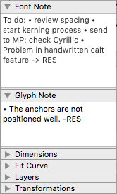

# Note Palettes for Glyphs

These are plugins for the [Glyphs font editor](http://glyphsapp.com/) by Georg Seifert. With them, you can comfortably edit the *font note* of the current font, and the *glyph note* of the current glyph. 

The **font note** is now accessible through *File > Font Info > Notes*, which makes the Font Note plugin obsolete. I therefore do not recommend installing the Font Note plugin anymore.

### Installation

1. Install *Glyph Note* via *Window > Plugin Manager*
2. Restart Glyphs.

To also install *Font Note:*

1. Create an alias of *FontNote.glyphsPalette* in `~/Library/Application Support/Glyphs/Repositories/GlyphNote/`
2. Move the alias to `~/Library/Application Support/Glyphs/Plugins/`

### Usage

1. To use the palettes, make sure the Palette sidebar shows: *Window > Palette* (Cmd-Opt-P).
2. You can always edit the font note in the *Font Note* palette.
3. To edit a glyph note, select one or more glyphs, and type in the *Glyph Note* palette.
4. You can resize either note palette by dragging the bottom double line up or down.

### Requirements

Recent versions of Glyphs and macOS. I can only test and guarantee its functionality in the latest OS and app versions. If the plugin does not work for you, you may have to update your app or your system.

### License

Copyright 2015 Rainer Erich Scheichelbauer (@mekkablue).
Based on sample code by Georg Seifert (@schriftgestalt) and Jan Gerner (@yanone).

Licensed under the Apache License, Version 2.0 (the "License");
you may not use this file except in compliance with the License.
You may obtain a copy of the License at

http://www.apache.org/licenses/LICENSE-2.0

See the License file included in this repository for further details.
