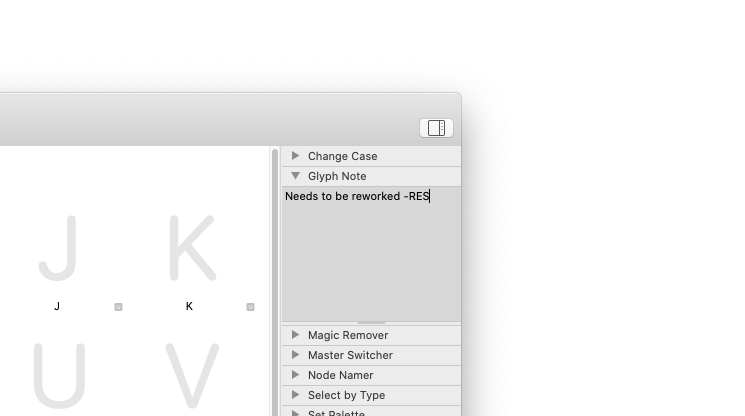

# Note Palettes for Glyphs

These are plugins for the [Glyphs font editor](http://glyphsapp.com/) by Georg Seifert. With them, you can comfortably edit the *font note* of the current font, and the *glyph note* of the current glyph. 

The font note is usually accessed through the *fontNote* custom parameter in *File > Font Info > Font > Custom Parameters*. The glyph note is otherwise only visible in the Font tab, switched to List mode, if the *Note* column is set to show (right-click on the column headers).

### Installation and Usage

1. Download the complete ZIP file and unpack it, or clone the repository.
2. Double click the .glyphsPalette files. Confirm the dialogs that appear in Glyphs.
3. Restart Glyphs.
4. To use the palettes, make sure the Palette sidebar shows: *Window > Palette* (Cmd-Opt-P).
5. You can always edit the font note in the *Font Note* palette.
6. To edit a glyph note, make sure only one glyph is selected, and type in the *Glyph Note* palette.
7. You can resize either note palette by dragging the bottom double line up or down.

### Requirements

The plugin needs Glyphs 2.2 or higher, running on OS X 10.9.5 or later. I can only test it in current OS versions, though.

### License

Copyright 2015 Rainer Erich Scheichelbauer (@mekkablue).
Based on sample code by Georg Seifert (@schriftgestalt).

Licensed under the Apache License, Version 2.0 (the "License");
you may not use this file except in compliance with the License.
You may obtain a copy of the License at

http://www.apache.org/licenses/LICENSE-2.0

See the License file included in this repository for further details.
